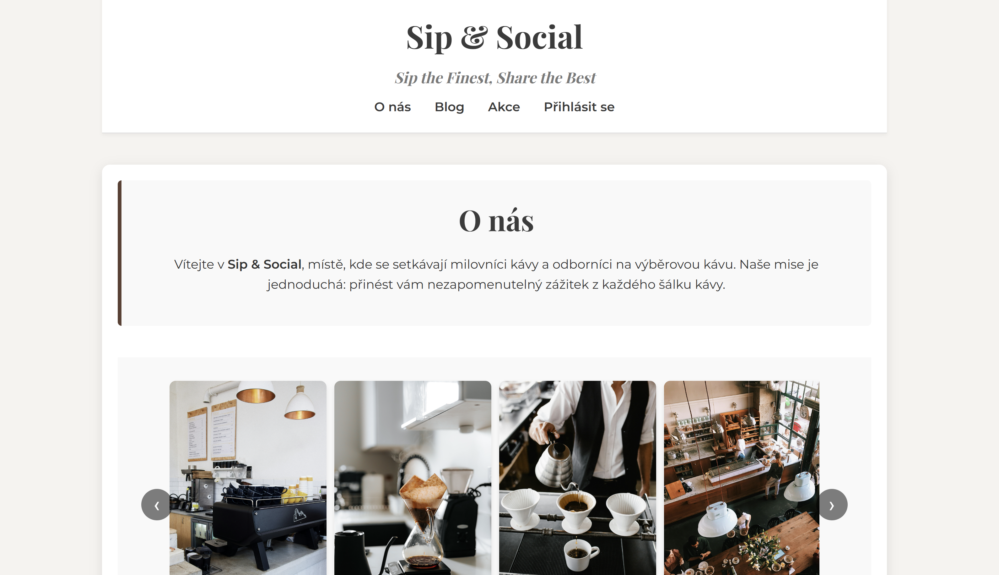
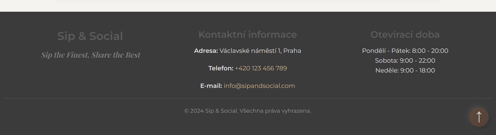
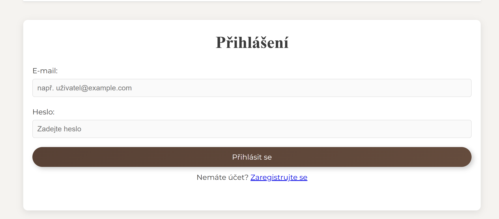
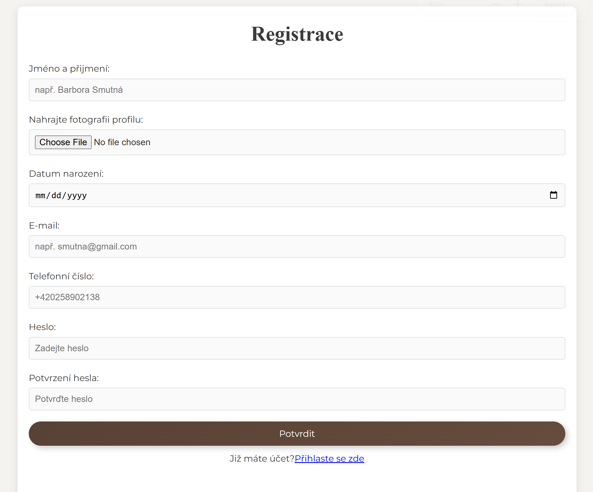
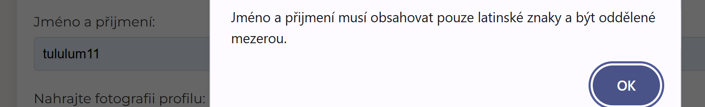
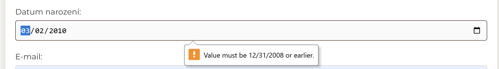
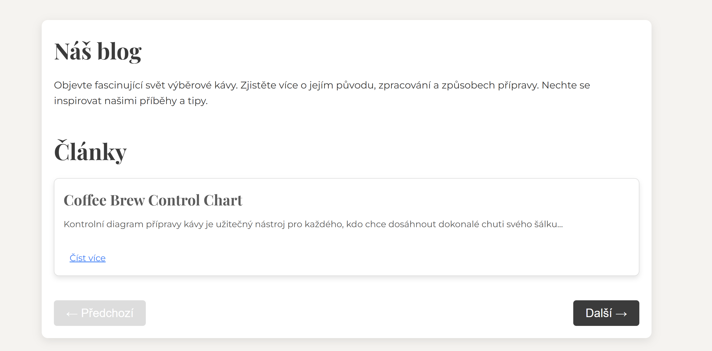
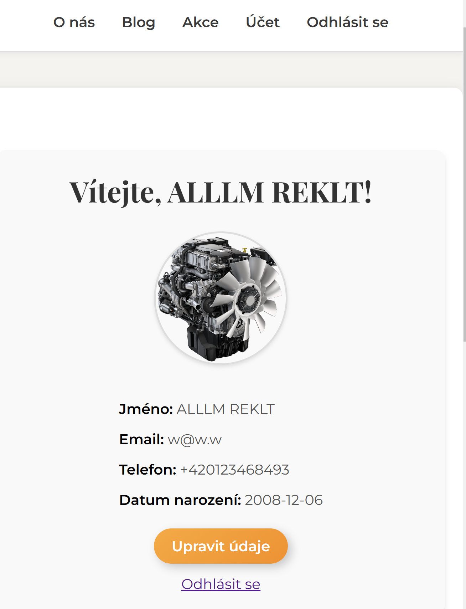
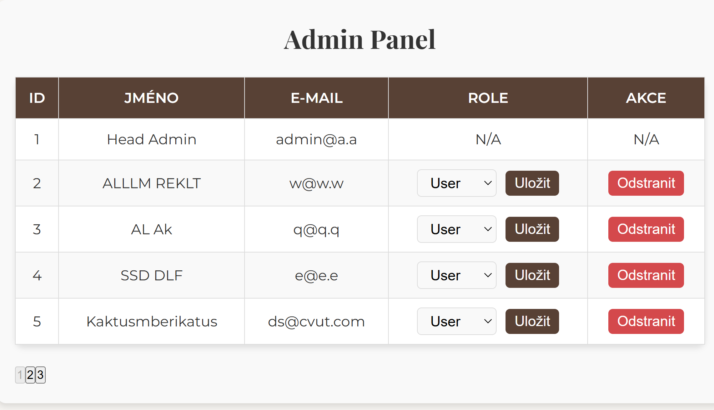

# ☕ Sip & Social

A role-based specialty coffee-themed website built with **HTML5, CSS, JavaScript, and PHP** (with a `JSON` backend). Designed as a simple interactive platform for coffee enthusiasts to learn, connect, and engage with exclusive content.

---

## 🌐 Overview

**Sip & Social** serves as an informational portal about specialty coffee — from bean harvesting to brewing techniques — while also offering registered users access to exclusive promo events and a user profile section.

The website supports **user roles**:
- 🔓 Guests – limited access
- 👤 Registered Users – full access to content
- 🛠️ Admins – manage users (role updates, deletions)

---

## 📄 Main Pages

| Page               | Description                                           |
|--------------------|-------------------------------------------------------|
| `index.php`        | Homepage with company info and intro                 |
| `vchod.php`, `ucet.php` | Registration, login, and profile management     |
| `teorie.php`       | Educational content about coffee processing          |
| `akce.php`         | Info on upcoming events & latte art workshops        |

---

## 🖼️ Screenshots

### 🏠 Homepage

### 🔐 Login & Registration

#### If the form is filled in incorrectly, the form displays an error message and the form cannot be sent to the server.

#### Registration name error

#### Registration date of birth error

#### If any field is filled in incorrectly, the user must re-add the file and fill in the password.

### 🖼️ Blog page

#### Guest blog page error

### 👤 User Profile

### 🛠️ Admin Panel

---

## 🔐 User Roles & Permissions

| Role           | Permissions                                                                 |
|----------------|------------------------------------------------------------------------------|
| Guest          | Can view limited content only; sees a warning when accessing restricted areas |
| Registered     | Full access to theory & promo content, editable profile                     |
| Admin          | Can manage users (change roles, delete), access admin panel                 |

---

## 🧰 Features

- ✅ Client + server-side form validation  
- ✅ Profile editing with live feedback  
- ✅ Password hashing for security  
- ✅ Role-based dynamic navigation  
- ✅ Admin panel with pagination (5 users/page)  
- ✅ JSON-based lightweight database (`data.json`)  

---

## ⚙️ Technologies

- **Frontend**: HTML, CSS, JavaScript  
- **Backend**: PHP (no SQL, data stored in JSON)  
- **Security**: Password hashing, input validation  

---

## 🚀 Getting Started

Just host the project on a PHP-enabled server (e.g. XAMPP, MAMP), and open `index.php` in the browser.

---

## 📌 Notes

This project does not use a SQL database — all user data is stored in a structured JSON file for simplicity and educational purposes.

